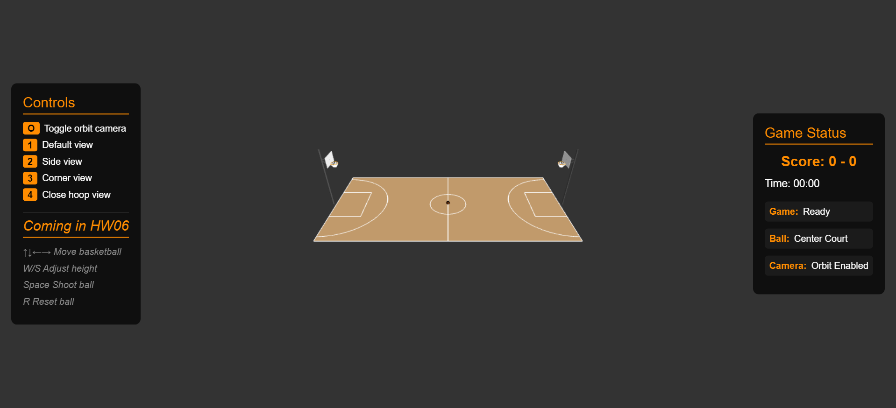
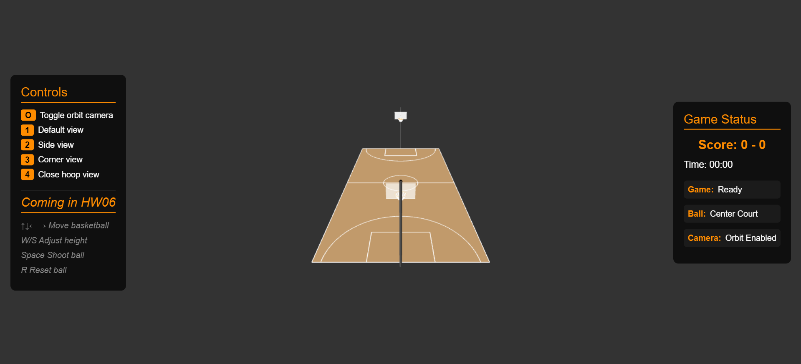
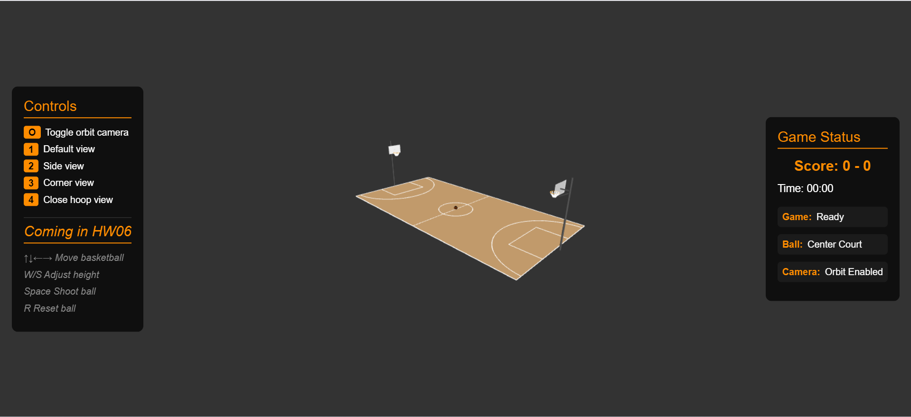
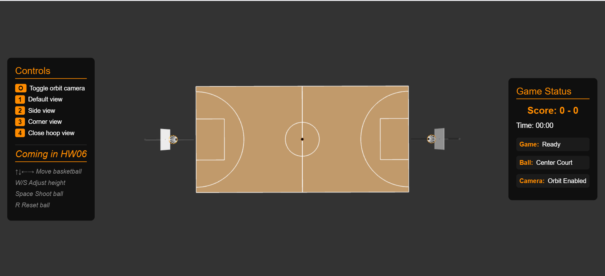
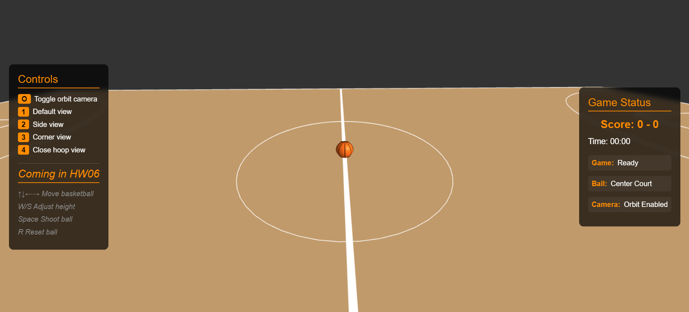
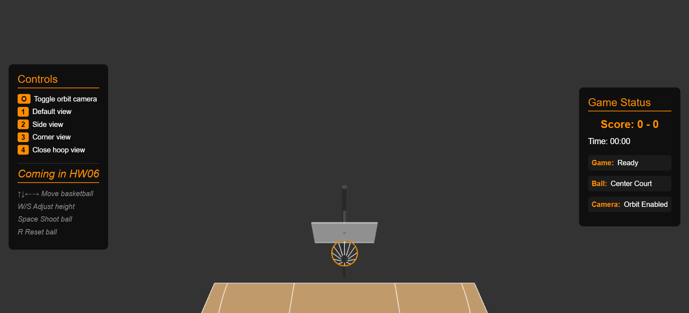

# Computer Graphics - Exercise 5 - WebGL Basketball Court

## Getting Started
1. Clone this repository to your local machine
2. Make sure you have Node.js installed
3. Start the local web server: `node index.js`
4. Open your browser and go to http://localhost:8000

## Group Members
**MANDATORY: Add the full names of all group members here:**
- Alon Regenbogen
- Tomer Leivy

## Camera Views
This basketball court visualization offers 4 different camera view options to explore the 3D scene:

### 1. Default Court View
The default view provides a balanced perspective of the entire basketball court.

### 2. Side View
A side perspective that shows the court from the sideline, perfect for viewing the basketball hoop and court dimensions.

### 3. Corner View
An angled corner view that provides a unique perspective of the court layout and three-dimensional structure.

### 4. Free Orbit Top View
A top-down view that allows you to see the entire court layout from above, ideal for understanding the court's geometry.

### Additional Features
- **Ball Positioning**: The basketball can be positioned at the center of the court
- **Close-up Views**: Zoom in for detailed views of specific court elements like the hoop

## Complete Instructions
**All detailed instructions, requirements, and specifications can be found in:**
`basketball_exercise_instructions.html`

## Technical Details
- Run the server with: `node index.js`
- Access at http://localhost:8000 in your web browser
